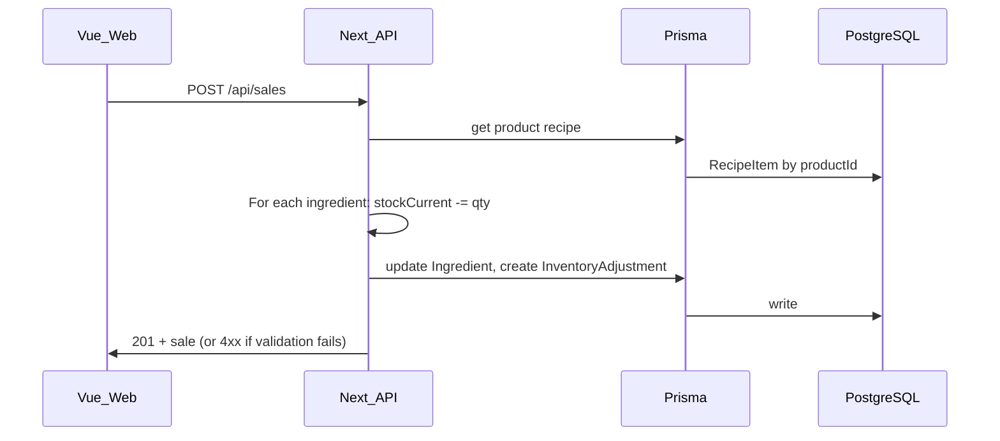

# Coffee Inventory MVP — Cursor Build Plan

This plan implements the system described in [architecture.md](architecture.md) and your Coffee Inventory MVP build spec. Tech stack and data models are fixed; tasks are ordered so each phase delivers runnable value.

---

## Architecture alignment


| Source                             | Scope                                                                                                             |
| ---------------------------------- | ----------------------------------------------------------------------------------------------------------------- |
| [architecture.md](architecture.md) | Goals, tech stack, domain models, inventory/forecast logic, API design, build order (Phases 1–4)                  |
| Your build plan                    | Exact project layout, Prisma field list, REST routes, Pinia store names, UI pages, seed data (Foxtrot), POS stubs |


Outcome: **Monorepo** with `apps/web` (Vue), `apps/api` (Next.js API), `packages/db` (Prisma), and `lib/forecasting` + `lib/posAdapters` at repo root.

---

## Target project structure

```
/apps
  /web        → Vue 3 + Vite + TypeScript, Pinia, Tailwind, Chart.js
  /api        → Next.js App Router (API routes only)
/packages
  /db         → Prisma schema + generated client
/lib
  /forecasting → Day-of-week forecast, reorder suggestions
  /posAdapters → square.ts, toast.ts (throw "Integration not implemented")
```

---

## Data flow (inventory on sale)




Inventory updates and adjustment logging happen **synchronously** in the same request. Negative stock is allowed with a warning (per your spec).

---

## Phase 1 — Skeleton

**1.1 Monorepo and apps**

- Root: `package.json` with workspaces (`apps/*`, `packages/*`), TypeScript base config, and scripts to run `web` and `api`.
- **apps/web**: Vue 3 + Vite + TypeScript, Vue Router, Pinia, Tailwind CSS, Chart.js. Single entry and router with placeholders for `/dashboard`, `/inventory`, `/menu`, `/sales`, `/settings` and auth (e.g. `/login`).
- **apps/api**: Next.js 14+ App Router, TypeScript. Only API routes under `app/api/`; no pages. Root layout minimal.
- **packages/db**: Prisma init, schema in `packages/db/prisma/schema.prisma`, client generated to `packages/db` and consumed by `apps/api`.

**1.2 Prisma schema (required models)**

Implement exactly as specified; add only fields that do not conflict (e.g. `updatedAt` where useful):

- **Shop**: id, name, timezone, createdAt  
- **User**: id, email, passwordHash, role (enum: OWNER | STAFF), shopId  
- **Ingredient**: id, shopId, name, unit, stockCurrent, reorderPoint, costPerUnit (optional updatedAt)  
- **InventoryAdjustment**: id, ingredientId, delta, reason, createdAt  
- **Product**: id, shopId, name, sku, isIced, isActive  
- **RecipeItem**: id, productId, ingredientId, quantity  
- **Sale**: id, shopId, productId, quantity, soldAt, source

All tenant-scoped resources use **shopId** for future multi-tenancy.

**1.3 Auth and shop scope**

- Simple email + password auth (prototype-grade): register + login API routes, session via HTTP-only cookie (e.g. encrypted cookie or minimal session store).
- Middleware/helper in API: resolve current user and **shopId** from session; all data routes must use this shopId (no cross-shop access).
- **apps/web**: auth store (Pinia), login/register UI, route guards so app routes require auth and (optionally) load current shop.

**1.4 Ingredient API**

- `GET /api/ingredients` — list ingredients for current shop.  
- `POST /api/ingredients` — create (body: name, unit, stockCurrent, reorderPoint, costPerUnit); set shopId from session.  
- `PATCH /api/ingredients/:id` — update; ensure ingredient belongs to current shop.  
- `POST /api/ingredients/:id/adjustments` — **required** for manual waste/corrections: body `delta`, `reason` (e.g. waste, spill, correction). Updates ingredient `stockCurrent` and **creates an InventoryAdjustment** so the audit trail is consistent with sale-driven adjustments. The inventory modal uses this route (not only PATCH) when recording manual adjustments.  
Validate inputs and return clean JSON. Use `packages/db` Prisma client.

---

## Phase 2 — Core value

**2.1 Products and recipes API**

- `GET /api/products` — list products for current shop (include recipe counts or full recipe if useful).  
- `POST /api/products` — create product (name, sku, isIced, isActive); shopId from session.  
- `POST /api/products/:id/recipe` — set/update recipe: body is list of `{ ingredientId, quantity }`; replace or upsert RecipeItems for that product, shop-scoped.

**2.2 Sales API and inventory deduction (critical)**

- `POST /api/sales` — body: productId, quantity, source (e.g. MANUAL), soldAt optional (default now).  
  - Load product and its RecipeItems.  
  - For each recipe line: `stockCurrent -= recipe.quantity * sale.quantity` (update Ingredient).  
  - Create one InventoryAdjustment per ingredient (delta negative, reason e.g. "sale").  
  - If stock would go negative: still apply but you may set a warning flag or log; per spec, "warn but allow".  
  - All in same request (synchronous).
- `GET /api/sales?from=&to=` — list sales for current shop in date range; validate from/to.

**2.3 Pinia stores (apps/web)**

Align with architecture §8: auth + shop + inventory + sales, plus products for menu/recipes.

- **authStore**: user, login/logout/register actions, session check.  
- **shopStore**: current shop (name, timezone, etc.); used on `/settings`, dashboard, and anywhere shop info is shown. Load after auth so UI can display shop name and timezone.  
- **inventoryStore**: ingredients list, fetch/update ingredients, **call POST /api/ingredients/:id/adjustments for manual adjustments**, derived low-stock list (compare stockCurrent to reorderPoint).  
- **productStore**: products list, fetch/create/update products, recipe get/set, derived cost-per-drink where applicable.  
- **salesStore**: submit sale, fetch sales (from/to), derived totals or daily breakdown.  
Keep derived data (totals, warnings, cost per drink) in stores, not in components.

**2.4 Vue pages — Inventory, Menu, Sales**

- **/inventory**: Ingredient list (from inventoryStore), stock level bars, reorder warnings, manual adjustment modal that calls **POST /api/ingredients/:id/adjustments** (delta, reason) so every manual change creates an InventoryAdjustment; use PATCH only for editing ingredient metadata (name, unit, reorderPoint, etc.).  
- **/menu**: Products list, recipe editor (ingredient picker + quantity), cost per drink display.  
- **/sales**: Manual sales entry form (product + quantity, optionally date); daily breakdown/list from salesStore.

---

## Phase 3 — Intelligence

**3.1 Forecasting library (lib/forecasting)**

- Input: shopId, ingredient (or all), horizon (7 or 30 days), **shop timezone** (from `Shop.timezone`).  
- Logic:  
  - Use **shop timezone** when grouping historical sales by **day of week** and when computing "today" for "today vs forecast"—so "Monday" and "today" align with the shop’s calendar, not UTC.  
  - Compute average quantity per product per weekday (rolling or fixed window).  
  - If insufficient history, fallback to last 7-day average.  
  - Forecast ingredient usage = product forecast × recipe quantities.
- Output: daily usage forecast, total usage, suggested reorder date, suggested reorder quantity.  
- Pure functions / small modules in `/lib/forecasting`; no Prisma inside lib—API layer will pass in data (e.g. sales + recipes from DB) and shop timezone.

**3.2 Forecast API**

- `GET /api/forecast?days=7` and `GET /api/forecast?days=30` — load sales and recipes for current shop, **load Shop.timezone**, pass timezone into forecasting lib, return JSON (daily breakdown, totals, reorder suggestions).

**3.3 Dashboard and charts**

- **/dashboard**:  
  - Sales trend (7 days) — Chart.js.  
  - Low-stock ingredients (from inventoryStore or small API).  
  - Today vs forecast (from forecast API).  
  - Signature drink highlight: "Foxtrot" performance (sales count or revenue if you have price).
- Use Chart.js only where it adds value; keep UI minimal and Tailwind-only (no component library).

---

## Phase 4 — Polish

**4.1 POS placeholders**

- **lib/posAdapters/square.ts** and **lib/posAdapters/toast.ts**: each export a function (e.g. `fetchSalesFromSquare()` / `fetchSalesFromToast()`) that throws with message `"Integration not implemented"`.  
- **Settings** UI: section "POS integrations" with Square/Toast listed as "Coming Soon" (no real calls).

**4.2 Seed data**

- Seed script (e.g. `packages/db/seed.ts` or `apps/api` script) runnable via `npx prisma db seed`:  
  - One **Shop**.  
  - One **User** (owner, role OWNER).  
  - Core **Ingredients**: espresso beans, whole milk, oat milk, **plus orange flavoring and cardamom** (so Foxtrot recipe works out of the box).  
  - Base **Products**: espresso, latte, iced latte.  
  - **Signature product "Foxtrot"**: recipe = espresso + orange flavoring + cardamom (ingredients must exist in seed).
- After seed, app is runnable and demoable without extra setup.

**4.3 Settings page and UI**

- **/settings**: Shop info (name, timezone), users list (placeholder or simple list), POS integrations (disabled / "Coming Soon").  
- Responsive (desktop + tablet), minimal and neutral, Tailwind only. Add clear TODO comments in code for future enhancements (multi-tenant, OAuth, real POS, etc.).

**4.4 Hosting and env**

- **Vercel**: Use **one Vercel project** at monorepo root; configure build/output so both `apps/web` and `apps/api` are deployed (e.g. web as frontend, api as serverless functions). Avoid two separate Vercel projects unless needed.  
- **Env**: `DATABASE_URL`, `SESSION_SECRET` (or equivalent).  
- **CORS**: Configure Next.js API to allow the web app’s origin and credentials (cookies). Required for cookie-based sessions when Vue runs on a different origin (e.g. `localhost:5173` vs `localhost:3000`, or separate Vercel URLs).  
- **API base URL**: Document and use an env var for the Vue app (e.g. `VITE_API_URL` or `VITE_API_ORIGIN`) so the frontend calls the correct API in local dev and in production (Vercel API URL).  
- **README**: How to run locally (DB, migrate, seed, dev servers), set `VITE_API_URL`, and deploy.

---

## Implementation notes

- **API**: All routes validate input and return consistent JSON; errors use appropriate status codes.  
- **Inventory**: Deduction and InventoryAdjustment creation in one transaction where possible; **manual adjustments** always go through `POST /api/ingredients/:id/adjustments` and create InventoryAdjustment.  
- **Forecasting**: Keep logic in `/lib/forecasting`; API only fetches data and shop timezone, then calls lib. Use **Shop.timezone** for day-of-week and "today".  
- **Stores**: authStore, **shopStore** (current shop), inventoryStore, productStore, salesStore; avoid duplicating derived logic in components.  
- **Code**: Readable, commented where non-obvious, suitable to pitch and run a real shop.

---

## Task summary (execution order)

Execute in the order below; each task is scoped so it can be implemented and verified before moving on.